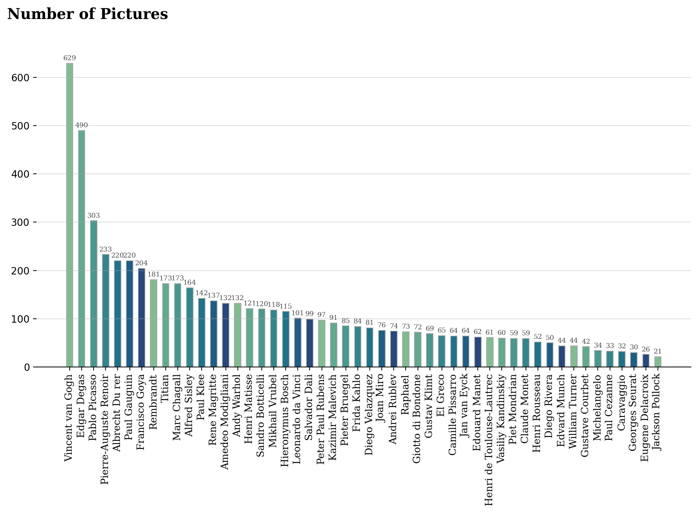
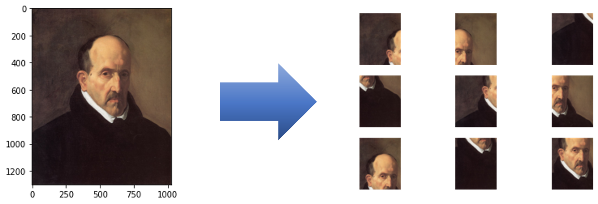
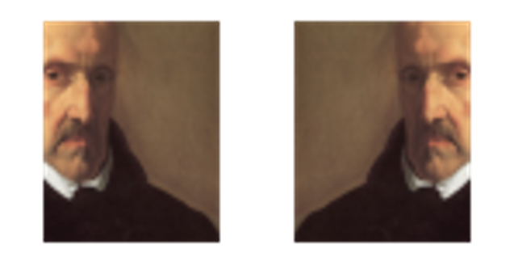
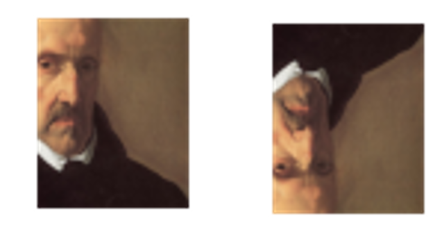
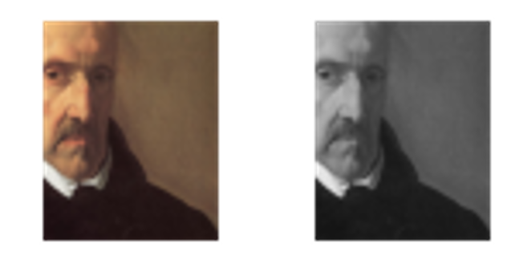
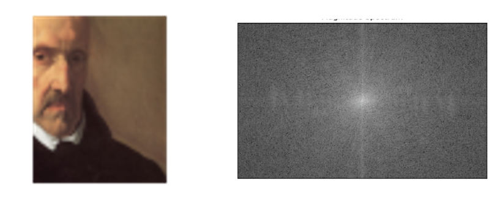
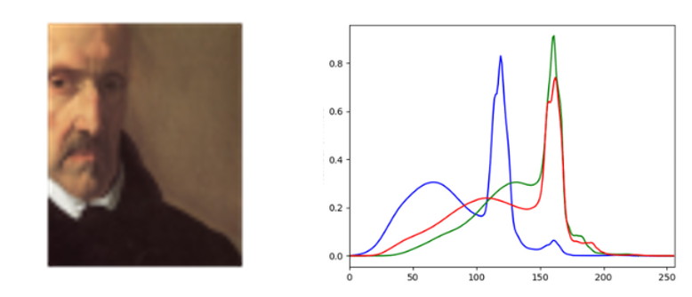

<h1> 월간 데이콘 예술 작품 화가 분류 AI 경진대회 </h1>

<h2> 목표 </h2>
<h4> 예술 작품을 화가 별로 분류하는 AI모델 개발 </h4>
 

<ul>
    <li>학습 데이터셋은 대표적인 화가 50명에 대한 예술 작품(이미지) 제공</li>
    <li>테스트 데이터셋은 대표적인 화가 50명에 대한 예술 작품(이미지)의 일부분 (약 1/4)만 제공</li>
    <li>학습에 활용할 수 있는 화가 50명에 대한 특징 정보(csv) 추가 제공</li>
</ul>

 
 

<h2> Train Data Set Analysis </h2>

 
 
</img>

<h5 align="center">< 데이콘 '이빨없는비둘기'님 데이터 분석 결과 ></h4>

 
 

<h4>
    <ul>
        <li>Target Data의 Imbalance 가 존재 </li>
        <li>Train Data Set은 원본 그림 / Test Data Set은 원본 그림의 일부분(약 1/4) </li>
    </ul>
</h4>

 
 

<h2> 인사이트 도출 </h2>

<h4>
    <ul>
        <li>Data Imbalance 해결해야 로버스트한 모델 가능 → group_softmax 파일로.. </li>
        <li>Train Data Set을 그대로 학습하기 보단 그림의 1/4로 Crop된 이미지로 학습 </li>
    </ul>
</h4>

 
 

<h2> Preprocessing </h2>

 

 
 </img>

<h5 align="center"> < Train Data를 1/4 크기로 Crop > </h4>

 

 Test Data가 원본 그림의 약 1/4의 크기이므로 모델을 학습시킬 때에도 원본 그림의 약 1/4의 크기로 Crop했다. 또, 데이터의 더 많은 구역을 볼 수 있도록 정방향 위치와 정중앙에서  1/4 크기로 Crop 데이터를 추출했다. 

 
 

<h2> Modeling (Multimodal) </h2>

Efficientnet-b0 Pre-Trained 모델을 기반으로 이미지에 대한 다양한 정보를 함께 학습시켜서 학습률을 높이려고 시도했다.
원본 이미지 외에 Filp, 색 분포(히스토그램), 흑백 이미지, 주파수영역 등 변수를 추가하여 학습했다. 

 

  </img> 

<h5 align="center"> < Vertical Flip Multimodal > </h5>

 
 

 

  </img> 

<h5 align="center"> < Horizontal Flip Multimodal > </h5>

 
 

 

  </img> 

<h5 align="center"> < Gray and Histogram Multimodal > </h5>

 
 

 

  </img> 

<h5 align="center"> < Fourier Transform Multimodal > </h5>

 
 

 

  </img> 

<h5 align="center"> < Color Histogram Multimodal > </h5>

 
 

<h2> Technique </h2>

Augmentation, TTA, Esemble 기법을 사용하여 모델의 성능을 최대한 이끌어내려고 시도했다.

 

<h3> Augmentation </h3>
albumentations 패키지를 사용했고 Horizontal, Vertical Flip을 통해 이미지를 증강했다.
그 외로 Normalize 나 텐서로 바꾸는 용도로 사용했다.

 

<h3> TTA(Test Time Augmentation) </h3>
ttach 패키지를 사용했고 Test Data를 Horizontal, Vertical Flip으로 증강하여 최종 예측을 했다.

 

<h3> Esemble </h3>
Esemble 기법을 통해서 위에서 설명한 모델과 팀원이 만든 다른 모델과 앙살블하여 모델의 성능을 최대한 끌어냈다.

 
 

<h2> 결과 </h2>
Private Score 0.854 6등으로 마무리  
Feature Enginnering 또는 Imbalance 문제를 해결하지 못해서 점수에 정체가 왔다고 판단된다.
